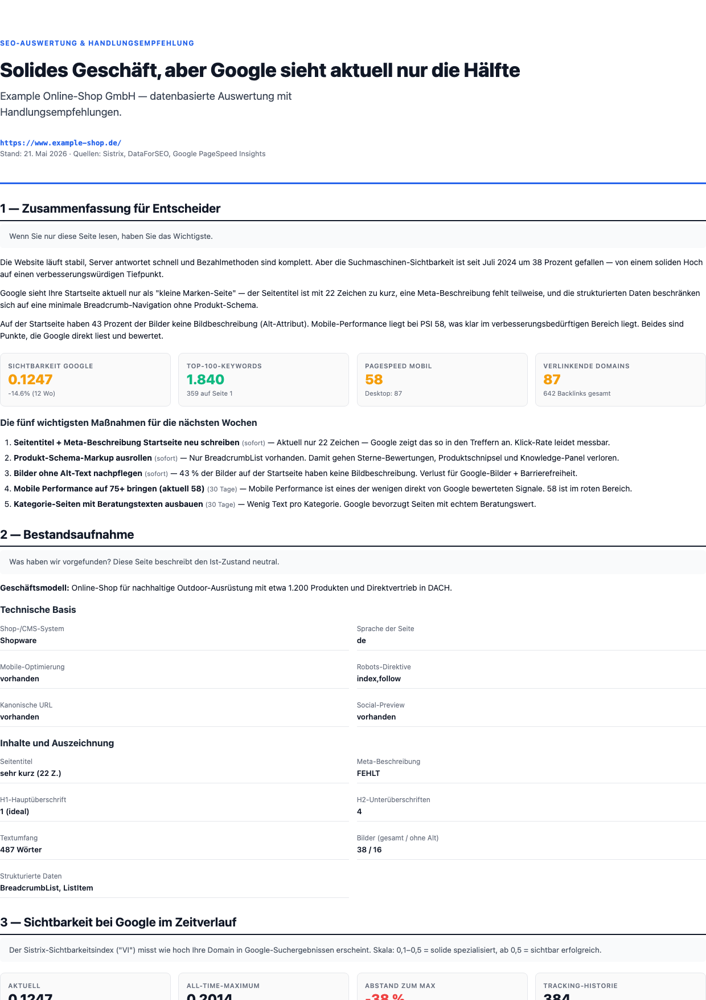

# SEO Survival Kit for Claude Code

> Six focused SEO skills built from real 2026 recovery cases — for any website owner who needs to understand what's wrong, what to fix, and how to talk about it to non-technical stakeholders. **E-commerce, publishers, SaaS, services, agencies — same workflow.**

[](https://opensource.org/licenses/MIT)
[](https://code.claude.com/)

## What's new

- **Renamed** from `seo-rescue-skills` to `seo-survival-kit` (2026-05-22) — better captures the scope: rescue + survival + growth across the post-AI-Overview 2026 SERP landscape. See [ROADMAP-2026.md](./ROADMAP-2026.md) for how the skills are positioned for Google's announced direction.
- **6 skills** covering free-tier audit → recovery framework → outreach reports → channel economics → competitor gaps → automated PSI tracking.
- **Smoke-tested** on 10 diverse domains across 7 categories (e-commerce, news, SaaS, comparison, content/UGC, services, travel) — pipeline works domain-agnostically.

## See it in action

Sample report generated with synthetic data — same layout you get for a real domain:



Full sample PDF: [examples/sample-audit.pdf](./examples/sample-audit.pdf) (1 MB, 10 pages)

## What this is

Most SEO Claude Code skills focus on **audits and implementation**. This plugin focuses on the scenarios audits don't fully address:

1. **You have no budget** for SEO tools and want a quick health check using only Google's free tools
2. **A website got hit by a Google Core Update** — what's actually happening, and how to recover over 6–12 months
3. **You want to send a non-technical site owner a polished SEO report** — outreach pitch, client handoff, founder briefing, board-level snapshot
4. **You need to know which channel actually makes money** (Amazon vs OTTO vs direct shop) and which to drop
5. **You need a real competitor analysis** that catches the actual organic competitors, not who you think competes
6. **You need automated weekly performance tracking** to catch regressions before customers do

If you're already running [claude-seo](https://github.com/AgriciDaniel/claude-seo) for technical audits, this complements it with the **free-tier entry path**, the **rescue framing**, the **decision-maker communication layer**, and **multi-channel financial perspective**.

**Who uses this:**
- 🏪 E-commerce shop owners and operators
- 📰 News publishers and content sites
- 💼 SaaS founders and growth teams
- 🛎️ Service businesses (agencies, consultants, freelancers)
- 🏥 YMYL sites (healthcare, finance, legal) — Authority-First recovery framework is especially relevant
- 🤝 SEO agencies and freelancers doing cold outreach

The skills are domain-type-agnostic. The example data in `examples/` happens to be an e-commerce sample, but the workflow works identically for a B2B SaaS or a news site.

## The six skills

### `seo-audit-free`

Beginner-friendly SEO health check using **only free tools**:
- Google Search Console (free with site verification)
- Google PageSpeed Insights v5 (25k calls/day free with API key)
- Lighthouse CLI (open source, runs locally)
- Schema.org Validator (browser-based, free)
- `curl` for robots.txt, sitemap, HTTP headers

Produces a 1-page Markdown report with traffic-light findings and three concrete next steps. **Zero API costs.**

**Use when** you don't have budget for paid SEO tools, want to evaluate whether a paid audit is worth it, or are auditing a friend's/family's website. Anti-use: deeper competitive analysis (needs the paid `seo-outreach-report`).

### `post-core-update-recovery`

Specific recovery framework for domains that lost visibility after a Google Core Update.

- Decision tree for distinguishing Core-Update damage from technical/CWV drops
- 4-phase plan: Authority foundation → Topical hubs → Off-page authority → Tech hygiene
- Realistic timelines (6–12 months, not 6–8 weeks)
- Counter-rationalizations for common owner panic-moves (buying backlinks, doing a relaunch, blaming CWV)

**Triggers automatically** when you describe a Sistrix VI drop correlating with a published Core Update, broad keyword loss with stable brand keywords, no technical changes, no manual action.

### `seo-outreach-report`

End-to-end pipeline that produces a polished A4 PDF SEO snapshot per domain — ready to send to a non-technical site owner.

**Pipeline** (4 small Node.js scripts in the skill folder):
1. `seo-audit-fetch-v2.js` — parallel Sistrix-VI + DataForSEO Labs + Google PSI v5 fetch
2. `seo-extract-v2.js` — extract KPIs, top keywords, quick wins (Pos 4–20 with SV≥100)
3. `seo-onpage.js` — title/meta/H1/schema check from local HTML
4. `seo-report-gen.js` — Chrome-headless HTML→PDF render with embedded SVG charts

**Report structure** (10 chapters, decision-maker language):
1. Cover with data-driven headline
2. Executive Summary (4 KPI gauges + Top-5 priorities)
3. Status Quo (what we found — neutral, no judgment)
4. Visibility chart with 18-month history
5. Top-15 rankings + Quick Wins table
6. Competitors
7. PageSpeed with traffic-light gauges
8. Schema/Title/Meta/Image-alt findings
9. Backlinks
10. Conclusion + 30/60/90-day action plan (per item: what, why, how, who, cost, expected impact)

PDF is ~1 MB per domain. Full pipeline runs in under 5 minutes per domain.

### `channel-economics-analyzer`

Channel-level P&L calculator for multi-channel e-commerce businesses (Amazon, OTTO, eBay, direct shop). Per channel: revenue, COGS, fees, ad-spend, operating margin, break-even order count. Tells you which channel is profitable and which is bleeding money.

**Use when** you sell across multiple marketplaces and want to know which to scale, hold, or wind down. Output: channel scorecard with traffic-light status and concrete action thresholds.

### `competitor-deep-audit`

DataForSEO-powered competitor analysis. Identifies the **real** organic competitors (not who the owner thinks), then computes keyword-gap-analysis: keywords where competitors rank top-10 but you don't, sorted by opportunity score (search volume × competitor density).

**Use when** planning content roadmaps or doing a new SEO mandate intake. Output: 30–50-item prioritized opportunity list per competitor audit. Cost: ~$0.10–$0.50 per audit.

### `psi-weekly-cron-baseline`

Automated weekly PageSpeed Insights tracking with regression detection. Runs as launchd/systemd/GitHub-Actions cron, stores history as NDJSON, alerts when scores drop > threshold vs N-week baseline. **Free** (uses PSI v5 free quota).

**Use when** you've done performance optimization and want to make sure it sticks — or when third-party plugins/themes have a history of silently breaking performance.

## Installation

**Recommended — pinned to a tag (reproducible, survives upstream changes):**
```shell
/plugin marketplace add maxschottke-spec/seo-survival-kit#v0.2.0
/plugin install seo-rescue@seo-survival-kit
/reload-plugins
```

Always-latest (less safe — a maintainer-account compromise would propagate on next reload):
```shell
/plugin marketplace add maxschottke-spec/seo-survival-kit
/plugin install seo-rescue@seo-survival-kit
/reload-plugins
```

See [SECURITY.md](./SECURITY.md#how-to-verify-before-trusting) for how to verify a pinned version before installing.

## ⚠️ Before you run anything — read these

| File | Why it matters |
|------|----------------|
| **[COSTS.md](./COSTS.md)** | The `seo-outreach-report` pipeline uses three paid APIs. ~€0.05–€0.50 per domain audit. Read first. |
| **[SECURITY.md](./SECURITY.md)** | What the scripts access, what they don't, and how to verify before trusting them. |
| **[MATURITY.md](./MATURITY.md)** | Honest comparison with mature alternatives. This is v0.1 — useful but not a complete suite. |
| **[ONBOARDING.md](./ONBOARDING.md)** | Step-by-step from install to first PDF in 15 minutes. |

`post-core-update-recovery` is free — no API costs, no setup needed beyond install.

`seo-outreach-report` requires API credentials for Sistrix + DataForSEO + Google PSI. Full walkthrough in [ONBOARDING.md](./ONBOARDING.md).

## Who should use this

| You are | This is for you |
|---------|----------------|
| **Freelance SEO consultant** | Outreach-report = lead-gen tool. Recovery skill = framework for diagnosing new desperate-client mandates. |
| **In-house SEO at an e-commerce shop** | Recovery skill after every Core Update hit. Outreach-report to communicate state to non-technical leadership. |
| **Boutique SEO agency** | Both skills as deliverable templates. Saves hours per onboarding and post-update analysis. |
| **Founder of a shop that lost traffic** | The recovery framework gives you a realistic plan and counter-arguments against panic-moves. |

## What this is NOT

- Not a replacement for `claude-seo` or other technical-audit skills. **Use this alongside them.**
- Not for sites that simply haven't built up SEO yet (<6 months old) — that's an aufbau phase, not a rescue
- Not a magic Core-Update recovery in 4 weeks — the skill is explicit that real recovery is 6–12 months

## Real-world data

Skills were built from four real-world domain audits in May 2026 (mid-size DE mattress shop, foam-cushion manufacturer, German news publisher, camper-mattress brand) and from one extended Core-Update recovery case (March/April 2026 update window).

## Self-improving via LESSONS.md

Each skill has a `LESSONS.md` file. As you use the skills and encounter new patterns or workarounds, append dated entries. After 3+ entries confirm a pattern, consolidate into the main SKILL.md. This way the skills get better the more you use them.

## License

MIT — see [LICENSE](./LICENSE).

## Contributing

This is a personal skill collection. PRs welcome if you've found real-world improvements, especially:
- New Core-Update lessons in `LESSONS.md`
- Better trigger phrases that improve skill discovery
- Bug fixes in the pipeline scripts

Open an issue if you want to discuss a larger change before opening a PR.

## Status & Maturity

Version 0.1 — first public release. Built and tested against real 2026 recovery cases (4 domain audits, 1 extended Core-Update recovery). Expect breaking changes until 1.0.

**Honest comparison** with mature alternatives (claude-seo with 6.9k stars is the reference): see [MATURITY.md](./MATURITY.md). This plugin is **niche complement**, not a replacement.
