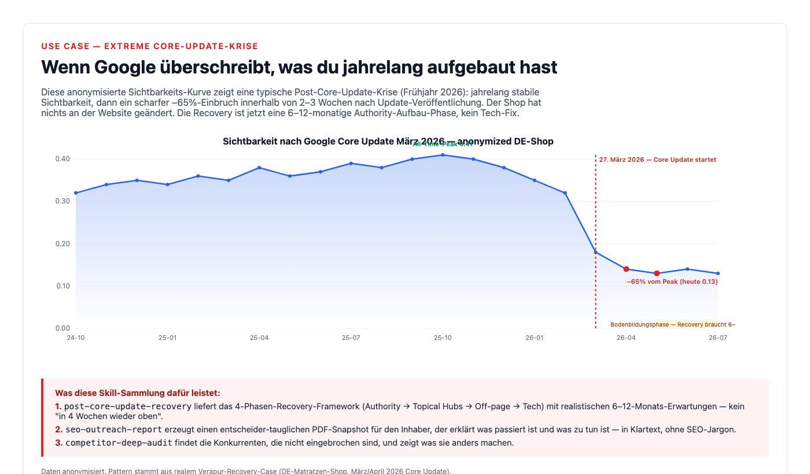

# SEO Survival Kit for Claude Code

> Nine Claude Code skills for SEO diagnosis and recovery workflows. Built and validated during one extended e-commerce Core-Update recovery in spring 2026. Open-source, MIT, zero runtime dependencies.

[](https://opensource.org/licenses/MIT)
[](https://code.claude.com/)
[](./CHANGELOG.md)

> **Status — Public Beta (v0.4.x).** Breaking changes possible between minor versions until v1.0. Pin to a tag (`#v0.4.0`) for reproducible installs. Two early tags (v0.2.0, v0.2.1) were yanked because the plugin manifest was at the wrong path — they were never actually installable. See [CHANGELOG.md](./CHANGELOG.md) for the full release history.

## Naming at a glance

The repository is named `seo-survival-kit`. The plugin inside it is named `seo-rescue`. Skills are namespaced with the plugin name:

| Refers to | Name |
|---|---|
| Repository / marketplace | `seo-survival-kit` |
| Plugin (technical) | `seo-rescue` |
| Slash commands | `/seo-rescue:rescue`, `/seo-rescue:seo-audit-free`, … |

The mixed naming is intentional (marketplace is the brand, plugin is the technical handle) but can be confusing on first contact.

## What's new

- **9 skills** covering free-tier audit → recovery framework → outreach reports → channel economics → competitor gaps → automated PSI tracking → AI-search visibility recovery → AI-citations weekly tracker → one-call GSC API snapshot.
- **Independent security audit** by [Jeronzo](https://github.com/kamehamea-art) on 2026-05-22 surfaced and drove fixes for one CRITICAL chain, 4 HIGH, 6 MEDIUM, 11 LOW issues. See [SECURITY.md](./SECURITY.md#external-security-reviews) for the audit summary.
- **Smoke-tested** on 10 diverse domains across 7 categories (e-commerce, news, SaaS, comparison, content/UGC, services, travel). Methodology in [MATURITY.md](./MATURITY.md).

## See it in action

### Sample outreach report

Same layout you get for a real domain — decision-maker-friendly, 10 chapters, ~1 MB PDF:


Full sample PDF: [examples/sample-audit.pdf](./examples/sample-audit.pdf)

### The use case: extreme Core-Update crash

This is the pattern these skills are built for — years of stable visibility, then a sharp −60% drop in 2-3 weeks after a published Google Core Update. Owner did nothing wrong. Recovery is now a 6–12 month authority-rebuild, not a tech fix:



See [ROADMAP-2026.md](./ROADMAP-2026.md) for documented public cases (HouseFresh, Glenn Gabe 2023-24, Dec 2025 retailer, Retro Dodo) and how Google's 2026 search direction shapes the recovery playbook.

## What this is

Most SEO plugins for Claude Code focus on technical audits and implementation. This plugin focuses on the adjacent scenarios:

1. You have no budget for SEO tools and want a quick health check using only Google's free tools
2. A website got hit by a Google Core Update, and the question is "what's actually happening, and how do we recover over 6-12 months"
3. You need to communicate the site's current SEO state to a non-technical reader (shop owner, founder, executive) in plain language
4. You need to know which sales channel actually makes money for a multi-marketplace shop, and which to wind down
5. You need a competitor analysis based on real SERP overlap, not on whom the owner thinks they compete with
6. You want automated weekly performance tracking with regression alerts

If you're already running [claude-seo](https://github.com/AgriciDaniel/claude-seo) for technical audits, this complements that workflow with the free-tier entry path, the recovery framing, the decision-maker communication layer, and a multi-channel financial perspective.

The skills are domain-type-agnostic. The example data in `examples/` happens to be an e-commerce sample, but the workflow works identically for a B2B SaaS, a news site, or a service business.

## Quick Reference

Every skill is reachable as a namespaced slash command. Type `/seo-rescue:rescue` in Claude Code to see the routing table, or call any sub-skill directly.

| Slash command | What it does | Cost |
|---|---|---|
| `/seo-rescue:rescue` | Orchestrator + routing table | free |
| `/seo-rescue:seo-audit-free <domain>` | Free-tier health check (GSC + PSI + Lighthouse + curl) | free |
| `/seo-rescue:post-core-update-recovery <domain>` | Core-Update diagnose tree + 4-phase Authority-First recovery plan | free |
| `/seo-rescue:seo-outreach-report <domain>` | 10-chapter A4 PDF for non-technical decision-makers (Sistrix + DataForSEO + PSI) | ~$0.05-$0.50 |
| `/seo-rescue:channel-economics-analyzer` | Per-channel P&L across 30+ marketplaces | free (your CSVs) |
| `/seo-rescue:competitor-deep-audit <domain>` | DataForSEO SERP-overlap + keyword-gap analysis | ~$0.10-$0.50 |
| `/seo-rescue:psi-weekly-cron-baseline` | Automated weekly PSI tracking with regression alerts | free |
| `/seo-rescue:ai-search-rescue <domain>` | AI Overviews + AI Mode + ChatGPT + Perplexity visibility recovery (framework) | free |
| `/seo-rescue:ai-citations-tracker` | **NEW v0.4** — weekly cron tracking brand citations in ChatGPT + Perplexity (NDJSON history) | ~$0.10/year |
| `/seo-rescue:gsc-deep-dive <domain> [days?]` | **NEW v0.4** — one-call Google Search Console snapshot (queries + pages + coverage + CrUX) | free |

## The nine skills

### `seo-audit-free`

Beginner-friendly SEO health check using **only free tools**:
- Google Search Console (free with site verification)
- Google PageSpeed Insights v5 (25k calls/day free with API key)
- Lighthouse CLI (open source, runs locally)
- Schema.org Validator (browser-based, free)
- `curl` for robots.txt, sitemap, HTTP headers

Produces a 1-page Markdown report with traffic-light findings and three concrete next steps. **Zero API costs.**

**Use when** you don't have budget for paid SEO tools, want to evaluate whether a paid audit is worth it, or are auditing a friend's/family's website. Anti-use: deeper competitive analysis (needs the paid `seo-outreach-report`).

### `post-core-update-recovery`

Specific recovery framework for domains that lost visibility after a Google Core Update.

- Decision tree for distinguishing Core-Update damage from technical/CWV drops
- 4-phase plan: Authority foundation → Topical hubs → Off-page authority → Tech hygiene
- Realistic timelines (6–12 months, not 6–8 weeks)
- Counter-rationalizations for common owner panic-moves (buying backlinks, doing a relaunch, blaming CWV)

**Triggers automatically** when you describe a Sistrix VI drop correlating with a published Core Update, broad keyword loss with stable brand keywords, no technical changes, no manual action.

### `seo-outreach-report`

End-to-end pipeline that produces a polished A4 PDF SEO snapshot per domain — ready to send to a non-technical site owner.

**Pipeline** (4 small Node.js scripts in the skill folder):
1. `seo-audit-fetch-v2.js` — parallel Sistrix-VI + DataForSEO Labs + Google PSI v5 fetch
2. `seo-extract-v2.js` — extract KPIs, top keywords, quick wins (Pos 4–20 with SV≥100)
3. `seo-onpage.js` — title/meta/H1/schema check from local HTML
4. `seo-report-gen.js` — Chrome-headless HTML→PDF render with embedded SVG charts

**Report structure** (10 chapters, decision-maker language):
1. Cover with data-driven headline
2. Executive Summary (4 KPI gauges + Top-5 priorities)
3. Status Quo (what we found — neutral, no judgment)
4. Visibility chart with 18-month history
5. Top-15 rankings + Quick Wins table
6. Competitors
7. PageSpeed with traffic-light gauges
8. Schema/Title/Meta/Image-alt findings
9. Backlinks
10. Conclusion + 30/60/90-day action plan (per item: what, why, how, who, cost, expected impact)

PDF is ~1 MB per domain. Full pipeline runs in under 5 minutes per domain.

### `channel-economics-analyzer`

Channel-level P&L calculator for multi-channel e-commerce businesses (Amazon, OTTO, eBay, direct shop). Per channel: revenue, COGS, fees, ad-spend, operating margin, break-even order count. Tells you which channel is profitable and which is bleeding money.

**Use when** you sell across multiple marketplaces and want to know which to scale, hold, or wind down. Output: channel scorecard with traffic-light status and concrete action thresholds.

### `competitor-deep-audit`

DataForSEO-powered competitor analysis. Identifies the **real** organic competitors (not who the owner thinks), then computes keyword-gap-analysis: keywords where competitors rank top-10 but you don't, sorted by opportunity score (search volume × competitor density).

**Use when** planning content roadmaps or doing a new SEO mandate intake. Output: 30–50-item prioritized opportunity list per competitor audit. Cost: ~$0.10–$0.50 per audit.

### `psi-weekly-cron-baseline`

Automated weekly PageSpeed Insights tracking with regression detection. Runs as launchd/systemd/GitHub-Actions cron, stores history as NDJSON, alerts when scores drop > threshold vs N-week baseline. **Free** (uses PSI v5 free quota).

**Use when** you've done performance optimization and want to make sure it sticks — or when third-party plugins/themes have a history of silently breaking performance.

### `ai-search-rescue`

Framework for recovering visibility in AI search surfaces — Google AI Overviews, Google AI Mode, ChatGPT, Perplexity, Bing Copilot, Claude.ai search. Different mechanics from classical SERP ranking: you're competing to be the source the LLM cites, not the link the user clicks. Seven optimization tactics (extractable passages, question-shaped headings, source-cited statements, author trust, schema for AI, llms.txt, Wikipedia), a three-layer measurement setup (brand-mention prompt set, GSC AI-traffic filter, AI-crawler logs), and a realistic 6-12 week recovery workflow.

**Use when** organic rankings have recovered but AI Overview citations are still going to competitors, or when a site says "ChatGPT keeps recommending the competitor, never us". One operational finding from real recovery work: AI citations move 2-6 weeks before classical Sistrix VI does, so they're a leading indicator that Authority-First work in `post-core-update-recovery` is actually being recognized.

## Installation

**Recommended — pinned to a tag (reproducible, survives upstream changes):**
```shell
/plugin marketplace add maxschottke-spec/seo-survival-kit#v0.4.0
/plugin install seo-rescue@seo-survival-kit
/reload-plugins
```

Always-latest (less safe — a maintainer-account compromise would propagate on next reload):
```shell
/plugin marketplace add maxschottke-spec/seo-survival-kit
/plugin install seo-rescue@seo-survival-kit
/reload-plugins
```

See [SECURITY.md](./SECURITY.md#how-to-verify-before-trusting) for how to verify a pinned version before installing.

## ⚠️ Before you run anything — read these

| File | Why it matters |
|------|----------------|
| **[COSTS.md](./COSTS.md)** | The `seo-outreach-report` pipeline uses three paid APIs. Typical run is €0.05–€0.50 per domain. Read first. |
| **[SECURITY.md](./SECURITY.md)** | What the scripts access, what they don't, and how to verify before trusting them. Includes the external-reviewer protocol. |
| **[MATURITY.md](./MATURITY.md)** | Honest comparison with mature alternatives. Current version is a v0.3 public beta — useful but not a complete suite. |
| **[ONBOARDING.md](./ONBOARDING.md)** | Step-by-step from install to first PDF in 15 minutes. |

`post-core-update-recovery` is free — no API costs, no setup needed beyond install.

`seo-outreach-report` requires API credentials for Sistrix + DataForSEO + Google PSI. Full walkthrough in [ONBOARDING.md](./ONBOARDING.md).

## When to use

- The site you're looking at had organic traffic and lost a large portion of it during or shortly after a published Google Core Update. The recovery framework gives you a phased Authority-First plan with realistic timelines, not a tech-hygiene chase.
- You need a non-technical decision-maker (shop owner, founder, executive) to understand the site's current SEO state. The outreach-report pipeline produces a 10-chapter A4 PDF in plain language.
- You have no budget for paid SEO tools and want a basic health check using only Google's free tools. The `seo-audit-free` skill is the entry point.
- You sell across multiple marketplaces and want to know which channel is actually profitable. The channel-economics-analyzer computes per-channel break-even and operating margin from your own CSVs.
- You want to set up weekly PSI monitoring with regression detection. Free over PSI v5 quota.
- You want to recover AI-Overview / ChatGPT / Perplexity citations, not just classical rankings.

## When *not* to use

- The site is brand new (< 6 months) and hasn't built up SEO yet. That is an aufbau-phase, not a rescue-phase. Use a classical technical-audit plugin like `claude-seo` first.
- You need a deep technical audit (crawlability, Core Web Vitals, schema validation across hundreds of URLs). Use `claude-seo:seo-audit`. This plugin complements that workflow, it doesn't replace it.
- You need a magic Core-Update recovery in 4 weeks. The framework is explicit that realistic recovery is 6–12 months.
- You expect production-grade guarantees, SLAs, or multi-user setups. This is a single-maintainer open-source plugin in public beta.

## YMYL notice

The action plans this plugin generates contain concrete cost ranges and timelines. For Your-Money-Your-Life sites (medical, legal, financial, regulated industries), have a domain expert review the action plan before publication or client delivery. The plugin treats all sites uniformly at the SEO-mechanics level; it does not validate domain-specific compliance or fiduciary requirements.

## Real-world data

Skills were built from one extended Core-Update recovery case (mid-size DE e-commerce shop, March/April 2026 update window) and validated against four additional real-world domain audits in May 2026 (foam-cushion manufacturer, German news publisher, camper-mattress brand, plus one originating shop). Patterns described in `LESSONS.md` files are observations from this case-base, not population statistics. Treat them as starting hypotheses to test in your own context.

## Self-improving via LESSONS.md

Each skill has a `LESSONS.md` file. As you use the skills and encounter new patterns or workarounds, append dated entries. After 3+ entries confirm a pattern, consolidate into the main SKILL.md. This way the skills get better the more you use them.

## License

MIT — see [LICENSE](./LICENSE).

## Security & external reviewers

Full threat model and verification steps: [SECURITY.md](./SECURITY.md).

If you're reviewing the plugin — independently, as a collaborator, or with LLM assistance — see [SECURITY.md → For external reviewers](./SECURITY.md#for-external-reviewers). It defines a short reporting protocol (`[VERIFIED]` / `[PROBABLE]` / `[UNVERIFIED]` labels, mandatory `file:line` citations, false-positive guidance for the bundled `skill-security-auditor`, and a copy-paste system prompt for free-tier/sandboxed LLM assistants).

To report a vulnerability: open a [GitHub issue](https://github.com/maxschottke-spec/seo-survival-kit/issues) for non-sensitive items, or email the maintainer directly for items that could affect installed users.

## Contributing

This is a personal skill collection. PRs welcome if you've found real-world improvements, especially:
- New Core-Update lessons in `LESSONS.md`
- Better trigger phrases that improve skill discovery
- Bug fixes in the pipeline scripts

Open an issue if you want to discuss a larger change before opening a PR.

## Contributors

- **[Max Schottke](https://github.com/maxschottke-spec)** — maintainer, original skills, plugin packaging
- **[Jeronzo](https://github.com/kamehamea-art)** — independent security review (audit 2026-05-22 surfaced the data-leak surface, prompt-injection chain, and `allowed-tools` hardening that landed in the v0.3.x security sprint)

## Need help running this on your own site?

The plugin is MIT and self-serve — you can run everything in this repo yourself for ~€0.05–€0.50 per audit plus a Sistrix subscription (see [COSTS.md](./COSTS.md)).

If you'd rather have someone with operational experience walk you through it on your specific case (Core-Update hit, AI-search visibility loss, multi-marketplace channel-economics, cold-outreach pipeline setup), the maintainer offers paid engagements:

| Engagement | What you get | Typical scope |
|---|---|---|
| **Recovery Audit (fixed)** | Full diagnose-PDF + 60-min strategy call + 4-phase 6-12 month plan | One domain, one Core-Update or AI-search problem |
| **Recovery Begleitung (retainer)** | Monthly reviews, plan adjustments, prioritization help | 3-6 months, weekly to bi-weekly cadence |
| **Outreach pipeline setup** | Configured pipeline + first 5 PDFs + handoff | One-time, for agencies that want decision-maker deliverables |

Contact: open a [Discussion](https://github.com/maxschottke-spec/seo-survival-kit/discussions) or reach the maintainer via the email on the [GitHub profile](https://github.com/maxschottke-spec). Calendly link will land here once the public beta period stabilises.

**Why hire the maintainer?** Because the framework comes from one specific recovery case (a mid-size DE e-commerce shop hit by the March 2026 Core Update) that is still in active recovery. The patterns in [LESSONS.md](./plugins/seo-rescue/skills/post-core-update-recovery/LESSONS.md) are observations from that work — paying for a session means getting context on *which* observations apply to your situation and *which* don't.

This is optional. The plugin works fine without it.

## Status & maintenance

Version 0.3.x — public beta. Single-maintainer open-source project. No SLA, no commercial support, no enterprise contracts. Issue response is best-effort within a few days. If you operate a production-critical workflow on this plugin, pin to a specific tag and review releases before upgrading.

Built and tested against real 2026 recovery cases (4 domain audits, 1 extended Core-Update recovery). The v0.3.x cycle survived an independent external security audit (1 CRITICAL chain + 4 HIGH + 6 MEDIUM closed) — see [SECURITY.md → External security reviews](./SECURITY.md#external-security-reviews). Expect breaking changes until 1.0.

**Honest comparison** with mature alternatives (claude-seo with 6.9k stars is the reference): see [MATURITY.md](./MATURITY.md). This plugin is a **niche complement**, not a replacement for technical-audit-focused plugins.
