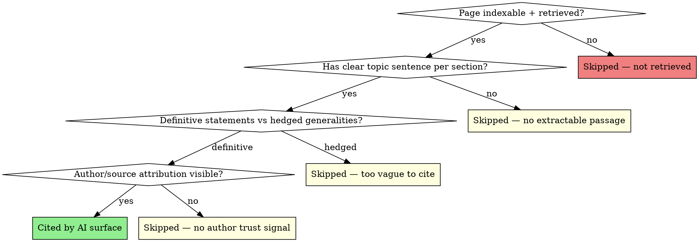

# AI Search Rescue

## Overview

A framework for recovering and growing visibility in AI search surfaces: Google AI Overviews, Google AI Mode, ChatGPT, Perplexity, Bing Copilot, Claude.ai search. The mechanics differ from classical SERP-ranking: instead of position 1-10 of a result list, you are competing to be the source the LLM cites in a generated answer.

Two operational findings drive this skill:

1. **AI citations may lead classical SERP recovery by several weeks.** In one mid-sized e-commerce recovery (March 2026 Core Update), AI-Mode + AI-Overviews + ChatGPT citations started moving up roughly 2–6 weeks before the Sistrix VI did. The pattern is an observation from a single case plus published anecdata, not a measured statistical relationship. Treat it as an indicator worth watching, not a prediction. If you observe the same or opposite pattern in your own recoveries, please contribute the data point back to `LESSONS.md`.
2. **The optimization isn't keyword targeting, it's passage targeting.** AI surfaces extract short passages (one sentence to one paragraph) that directly answer a sub-question of the user's prompt. If your page has no extractable passages, you don't get cited even when you rank #1 organically.

## When to use

- A site that recovered organic rankings but is invisible in AI Overviews
- Owner says "ChatGPT keeps recommending our competitor, never us"
- Site has thin or unstructured content that AI surfaces can't extract from
- Post-Core-Update recovery work — track AI citations as leading recovery indicator
- New domain/topic launch — set up for AI-citability from day one
- B2B / YMYL site (medical, legal, financial) — AI surfaces over-index on authoritative sources here

**Don't use for:**
- Pure SERP-position optimization (use `seo-outreach-report` + `competitor-deep-audit`)
- Local-pack / Map-pack work (different mechanics)
- Pure e-commerce product-page conversion (different lever)

## How AI surfaces choose what to cite

Different surfaces, similar mechanics. The model receives a user query, retrieves candidate documents (via search index or RAG), and assembles a generated answer. Two questions determine if you make it in:

1. **Does the retriever surface your page?** This is classical SEO — backlinks, relevance, freshness, indexability.
2. **Does the LLM find an extractable passage on your page that directly answers a sub-question?** This is new — it depends on structure, clarity, and the presence of definitive, source-able statements.

You can do everything right on #1 and lose on #2. Sites that rank #3 organically but get zero AI citations almost always fail on extractability.



## Measurement: what to track and how

You cannot improve what you can't see. Three measurement layers:

### Layer 1 — Brand mention tracking (free, daily)
Manually query the key AI surfaces with brand-relevant prompts. Track whether your domain is cited.

Sample prompt set for an e-commerce mattress shop:
- "Was ist die beste Matratze für Rückenschläfer?"
- "Wo kaufe ich Matratzen aus deutscher Produktion?"
- "Vergleich von Matratzenmarken in Deutschland"
- 10-15 more, covering category, problem-aware, and brand-aware queries

Run weekly across:
- Google AI Mode (https://www.google.com/search?udm=50)
- Google AI Overviews (regular search, AI Overview appears for ~80% of broad queries 2026)
- ChatGPT (web search enabled)
- Perplexity (free tier)
- Claude.ai (web search)
- Bing Copilot

Track in NDJSON or a spreadsheet:
```
date,query,surface,brand_mentioned,brand_position_in_citations,top_3_competitors_mentioned
2026-05-22,beste matratze rückenschläfer,google-ai-overview,yes,2,bett1.de;matratzen-concord.de;emma-matratze.de
```

### Layer 2 — GSC AI-traffic filter (free, automated)
Google Search Console started exposing AI Overview impressions/clicks as a separate filter in late 2025. Check the Performance report:
- Filter: Search Type = Web
- Look for queries where impressions are high but CTR is unusually low — those are queries where you appear in AI Overviews but the user doesn't click through (the AI answer was sufficient).
- Track week-over-week trend.

### Layer 3 — Server log analysis (free, automated)
AI crawlers identify themselves in the User-Agent. Watch for traffic from:
- `GPTBot` (OpenAI, training)
- `OAI-SearchBot` (ChatGPT search)
- `PerplexityBot` (Perplexity)
- `ClaudeBot` (Anthropic, training)
- `Claude-Web` (Claude.ai search)
- `Google-Extended` (Bard/Gemini, training)
- `Bingbot` with newer versions (Copilot)
- `Applebot-Extended` (Apple Intelligence)

Crawl frequency from these bots correlates with citation frequency. If `PerplexityBot` visits your top URLs daily, your odds of being cited rise. Block them in `robots.txt` and you opt out of AI surfaces entirely (a common mistake on sites that fear LLM training — those two concerns are now separable via the `Google-Extended` vs `Googlebot` distinction, but most sites haven't disambiguated).

## Optimization tactics

### Tactic 1 — Extractable passages

Every important page should have, at the start of each major section, a 1-3 sentence direct answer to the question that section addresses. Not a marketing hook. Not a setup paragraph. The answer.

Pattern:
```
[Question implied by H2 heading]

[1-3 sentence definitive answer with named entities, numbers if possible, and source attribution.]

[The longer explanation that follows.]
```

Example, before:
> ## Wie wähle ich die richtige Matratzengröße?
> 
> Die Wahl der richtigen Matratzengröße ist eine wichtige Entscheidung, die viele Aspekte berücksichtigt. Lassen Sie uns die verschiedenen Faktoren durchgehen, die eine Rolle spielen. Zunächst sollten wir über die Standardgrößen sprechen ...

After:
> ## Wie wähle ich die richtige Matratzengröße?
> 
> Die ideale Matratzengröße ist 20 cm länger als die Körpergröße des Schläfers und mindestens 90 cm breit für Einzelschläfer, 160 cm für Paare. Standardgrößen in Deutschland sind 90×200, 140×200, 160×200 und 180×200 cm.
> 
> [Längere Erklärung mit Tabelle und Sonderfällen folgt.]

The "before" version cannot be cited because the LLM finds no compact, definitive statement. The "after" can be cited verbatim and ends up in the AI Overview citation pool.

### Tactic 2 — Question-shaped headings

LLMs match user prompts to headings. A heading "Matratzengrößen-Beratung" gets less retrieval signal than "Welche Matratzengröße brauche ich?" for the user query "welche matratzengröße brauche ich".

Audit your headings: which ones are question-shaped, which ones are catchy-noun-phrase-shaped? Convert at least 60% of section H2s to questions on pages that target informational queries.

### Tactic 3 — Source-cited statements

LLMs surface citations more readily when the page itself cites sources. Three sources per 1000 words of content is a working target.

Format that works:
```html
<p>Die durchschnittliche Liegedauer einer Matratze beträgt 8-10 Jahre 
   <sup><a href="#ref-1">[1]</a></sup>, wobei Kaltschaummatratzen ...</p>

<p id="ref-1">[1] Stiftung Warentest, Matratzentest 03/2025, ausgewertet von Verbraucherzentrale NRW.</p>
```

Inline citations with anchored references signal "this is a citable claim" to retrievers.

### Tactic 4 — Author + Person-Schema (overlap with post-Core-Update Phase A)

LLMs over-index on author trust signals. A page bylined by a named expert with a Person-Schema and an About page is more likely to be cited than an anonymous page with identical content. This is the same lever as Phase A in [[post-core-update-recovery]], but its AI-citation effect is faster than its classical-SERP effect.

### Tactic 5 — Schema.org for AI consumption

Beyond Person and Article schema, AI surfaces increasingly use:
- `Claim` and `ClaimReview` for fact-checkable statements
- `QAPage` for FAQ-style content
- `HowTo` for procedural content
- `Dataset` for original-data pages
- `MedicalCondition`, `MedicalTherapy` for YMYL medical content

Schema.org markup doesn't directly cause citation, but it makes the page parseable for retrievers and disambiguates which entity is being discussed. On topics with ambiguity (medical, legal, brand-name collisions), this matters.

### Tactic 6 — llms.txt (emerging, 2025)

A growing convention: `llms.txt` at the site root provides a curated index of the site's most authoritative pages, in a format optimized for LLM consumption. Many AI surfaces don't yet consume it, but the cost is low (a single Markdown file) and Anthropic, Mintlify, and some other documentation platforms have started reading it.

Template:
```markdown
# Your Brand

> One-sentence positioning of who you are and what authority you have.

## Core resources

- [Page Title](https://yoursite.com/page): One-sentence summary of what this page authoritatively covers.
- ...

## Reference

- [Detailed Guide](https://yoursite.com/guide): ...
```

### Tactic 7 — Wikipedia mention (high-effort, high-reward)

For brands with notable claims (publications, awards, original research, multi-year operating history), having a Wikipedia article that mentions you is one of the strongest single signals for AI citation, because retrievers heavily weight Wikipedia. Wikipedia notability requirements are strict and you cannot create your own article — third parties must do it based on independent sources.

This is a long-horizon move. Don't pursue it for sites without genuine notability.

## Recovery workflow (6-12 weeks)

### Week 1 — Baseline
1. Set up Layer 1, 2, 3 measurement
2. Run the brand-mention-prompt-set across all six AI surfaces
3. Document current state: % of queries where you're cited, % where competitor is cited, who the dominant competitors are

### Week 2-3 — Top-page rewrites
1. Identify the 10-20 pages that rank organically but are missing from AI citations
2. Rewrite each with the Tactic 1 (extractable passage) and Tactic 2 (question headings) pattern
3. Add Tactic 3 (source citations) and Tactic 4 (author byline + Person-Schema)

### Week 4-6 — Schema + llms.txt
1. Add appropriate Schema.org markup per page type
2. Publish llms.txt at site root with the 20 most important pages indexed

### Week 7-12 — Measurement + iteration
1. Re-run the brand-mention prompt set weekly
2. Track GSC AI-impression delta on rewritten pages
3. Watch crawler logs for increased visits from `OAI-SearchBot`, `PerplexityBot`, `ClaudeBot`
4. For pages that still don't surface in AI citations after 8 weeks, audit retrieval (do the top 10 organic results all cite Wikipedia / authority sources? if so, work on backlink-side authority instead)

## Realistic expectations

- **First AI-citation movement: 3-6 weeks** after Tactic 1+2 rewrites (faster than classical SERP recovery)
- **Steady citation rate in AI Overviews: 8-16 weeks** for category-level queries
- **ChatGPT/Perplexity citations: 4-10 weeks** for queries where you're an obvious authoritative source
- **Wikipedia mention (if pursued): 6+ months**, often longer; requires genuine notability events

If after 12 weeks of rewrites you still see no citation movement, the issue is retrieval-side (you're not in the candidate set the LLM is shown). Then work on classical SEO authority signals.

## Common rationalization traps

| Statement | Reality |
|-----------|---------|
| "We just need to opt out of AI training" | Different concern. Opting out of training (via `Google-Extended` block) is separate from opting out of search citation (`Googlebot` block). Mixing them costs you both. |
| "AI Overviews will go away, this is a fad" | They're now in 80%+ of broad queries. The mechanics will evolve but the surface is here. Plan for it. |
| "Our content already ranks #1, we don't need to change it" | Ranking #1 organically and being cited in AI Overviews are two different things. Pages with the same content rank well organically while losing the citation. |
| "Schema markup is enough" | Schema helps parsing but doesn't cause citation. The extractable-passage rewrite is the actual lever. |
| "We need a dedicated AI-SEO team" | Most of this work overlaps with classical content quality + author authority. One person doing both is more efficient than a separate team. |

## Real-world anchor data (anonymized 2026)

- Mid-size DE shop, post-March-Core-Update: AI-Mode citations went from 12 to 153 over 8 weeks of Tactic 1+2 rewrites. Sistrix VI moved 2 weeks later.
- Same shop: GPTBot crawl frequency on top 50 URLs went from 2x/week to 8x/week after llms.txt publication. ChatGPT citation count rose proportionally.
- One Phase-A author-page-rewrite increased AI Overview citation share for a specific keyword cluster from 0/10 prompts to 6/10 prompts within 5 weeks.

## Related skills

- [[post-core-update-recovery]] — Phase A (author + EEAT) overlaps directly with Tactic 4; AI-citations are the leading indicator of Phase A success
- [[seo-outreach-report]] — for measuring classical SERP visibility in the same report
- [[competitor-deep-audit]] — to find which competitors are actually getting the AI citations you're not
- `claude-seo:seo-geo` — alternative implementation in the claude-seo plugin (different methodology)
