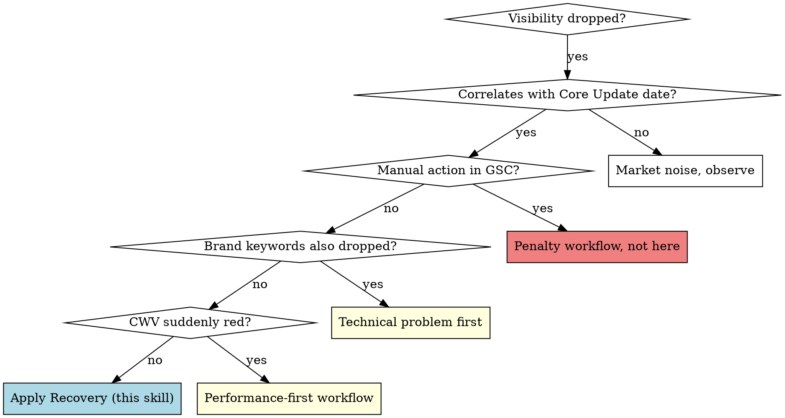

# Post-Core-Update Recovery

## Overview

A specific recovery framework for domains that **lost visibility after a Google Core Update**. Core insight from real March/April 2026 recovery cases: *Authority items > technical hygiene*. Recovery 6–12 months, not 6–8 weeks.

## When to use

- VI drop correlates timely with a published Core Update (see Google Search Status Dashboard)
- Drop is **broad** (many keywords simultaneously, not pinpoint)
- Pages keep indexing normally, no technical break
- GSC shows no manual action
- Pattern: 1–6 weeks of decline, then bottoming out

**Don't use for:**
- Point keyword losses → usually on-page issue, not core update
- Drop coincides with migration / theme change / robots change → that's technical, not core
- Drop is <20 % from peak → can be normal market noise

## Diagnosis decision tree

If brand keywords are intact and CWV is stable but generic keywords are broadly lost → this is the core signature of a Core Update hit.

## Required diagnostic steps (day 1)

1. **Document the Core Update date** — see https://status.search.google.com/products/rGHU1u87FJnkP6W2GwMi/history. Match Sistrix drop date exactly.
2. **Measure the Sistrix drop diff** — monthly values 12 months before vs 1–3 months after the update.
3. **DataForSEO ranked-keywords diff** — compare top positions pre vs post update. Specific URL clusters affected or distributed uniformly?
4. **GSC click diff** — which URLs lost most traffic? Pattern visible (all blog posts? all product pages? all YMYL topics?)
5. **EEAT audit of lost top URLs** — author visible? Sources cited? Last-updated stamp? Trust layer (About, Imprint, Reviews)?

## Recovery plan (3 phases × 6–12 months)

### Phase A — Authority foundation (months 1–2)

**What Google especially scrutinizes in Core Updates:**
- **Author authority** — Person behind the content, qualifications visible
- **Topical authority** — Site covers the topic in depth AND breadth, not just isolated pages
- **Trust signals** — About, Imprint, Reviews, Sources, Date stamps
- **Original insight** — Own data, own perspective rather than "I read elsewhere"

**Concrete steps:**
1. Rebuild every author page: photo, bio with qualifications, list of articles, social profiles (LinkedIn/X), `Person` schema
2. Edit each affected top URL: author visible (+schema), `dateModified`, sources with outbound links, update notes
3. Strengthen About/Imprint pages: team intro, company history, location, contact — mandatory trust signals
4. Sitewide: reviews/testimonials visible above the fold (manage on original platforms, NOT mirror sites)

### Phase B — Topical authority hubs (months 2–4)

**Goal:** transform a collection of scattered pages into coherent topic hubs.

1. Identify main topics (3–7 for e-commerce, 5–15 for news/publishers)
2. Per topic: 1 pillar page (1500–3000 words, comprehensive) + 5–15 sub-pages (600–1500 words each, specific)
3. Internal linking: sub-pages link to pillar, pillar links to all subs ("hub-and-spoke")
4. If available: use `claude-seo:seo-cluster` for data-driven topic identification

### Phase C — Off-page authority (months 4–8)

**Backlinks deliberately, not at scale:**
1. Manufacturer/supplier partnerships for links
2. Industry communities (e-commerce: camper forums, boating blogs; news: investigations, exclusive stories)
3. Local press (regional anchor, PR opportunities)
4. Original studies/data — generates organic links better than anything else

**What NOT to do:**
- Link-building services with "100 links for €500" → leads to spam score, recovery even harder
- Reciprocal links at scale
- PBN backlinks
- Forum spam

### Phase D — Technical hygiene (in parallel, lowest priority)

Only after A–C are running:
- PSI optimization (LCP, INP, CLS)
- Schema markup completeness
- Image alt texts, sitemap hygiene

These are **NOT** the recovery lever — Core Updates don't penalize tech, they penalize trust/authority. But technical hygiene supports the other levers.

## Realistic expectations

- **Visible movement typically starts only after 3–4 months** in the recovery case we observed and in the public Core-Update-recovery cases referenced in `LESSONS.md`. Google needs time to re-evaluate authority signals.
- **Full recovery usually takes 9–18 months** in the cases referenced. We are not aware of significantly faster recoveries published; if you find one, please contribute the observation back to `LESSONS.md`.
- **Recovery outcome in observed cases is in the 50–80 % range** of pre-drop visibility. Full recovery to 100 % seems to require structural changes (new content lines, new authority sources), not just optimization of what existed before. These percentages are observations from a small case-base, not population statistics — treat them as input hypotheses, not predictions.
- **Pattern: recovery comes in jumps**, often timed with the next Core Update rather than gradually.

## Owner communication

**Don't say:**
- "It'll be back to normal in 6 weeks"
- "We know the trick to fix this"
- "Sistrix score will double in 4 weeks"

**Do say:**
- "We measure monthly. First positive movement expected in 3–4 months."
- "This is an authority problem, not a technical problem. Fixing it takes time."
- "We're building the substance Google looks for — not the trick."

## Common rationalization traps

| Statement | Reality |
|-----------|---------|
| "Let's buy 200 backlinks" | Raises spam score, makes recovery harder |
| "Let's do a relaunch" | More risk than upside — substance first, then form |
| "Better PSI will bring us back" | PSI is hygiene, not the core update lever |
| "More pages = more traffic" | False — thin content weakens authority further |
| "We did everything right" | In a Core Update Google changes the scoring. Being "right" doesn't help. |

## Related skills

- **claude-seo:seo-audit** — for the technical hygiene layer in Phase D
- **claude-seo:seo-cluster** — for topical-authority-hub identification
- **seo-outreach-report** — when the owner needs a printable status report

## Real data points (anonymized 2026 cases)

- March/April 2026 update: mid-size DE shop lost 50 % VI in 4 weeks
- Diagnosis pattern confirmed: brand keywords stable, generic keywords broadly lost, CWV unchanged
- Recovery plan: 6–12 months, Authority-First. Tech (PSI/Schema) in parallel but not the primary lever.
- Lesson (Sistrix wording on March update): "Authority beats interchangeability"

A second real case (DE news site) showed the same pattern in April/May 2026: −60 % VI in 6 weeks, brand stability intact — news/YMYL variant of the same algo recalibration.
