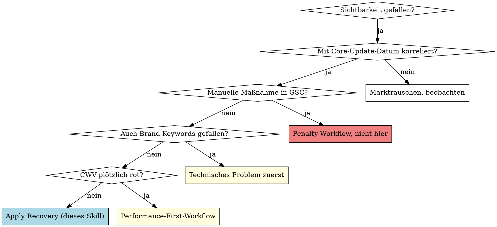

# Post-Core-Update Recovery

## Overview

Spezifisches Recovery-Framework für Domains, die **nach einem Google Core Update** Sichtbarkeit verloren haben. Kernerkenntnis aus realen März-/April-2026-Recovery-Cases: *Authority-Items > Tech-Hygiene*. Recovery 6–12 Monate, nicht 6–8 Wochen.

## Wann anwenden

- VI-Drop fällt zeitlich mit publiziertem Core Update zusammen (siehe Search Status Dashboard)
- Drop ist **breit** (viele Keywords gleichzeitig, nicht punktuell)
- Pages indexieren weiter normal, kein technischer Bruch
- GSC zeigt keine Manual Action
- Pattern: über 1–6 Wochen, dann Bodenbildung

**Nicht anwenden für:**
- Punktuelle Keyword-Verluste → meist on-page-Thema, kein Core-Update
- Drop fällt mit Migration / Theme-Change / Robots-Änderung zusammen → das ist technisch, nicht Core
- Drop ist <20 % vs Peak → kann normales Marktrauschen sein

## Diagnose-Entscheidungsbaum

Wenn Brand-Keywords intakt sind und CWV stabil ist, aber Generic-Keywords breit verloren → das ist die Kern-Signatur eines Core-Update-Hits.

## Diagnose-Pflichtschritte (Tag 1)

1. **Core-Update-Datum dokumentieren** — siehe `https://status.search.google.com/products/rGHU1u87FJnkP6W2GwMi/history`. Sistrix-Drop-Datum exakt damit abgleichen.
2. **Sistrix-Drop-Diff messen** — siehe `sistrix-deep-fetch` Pattern, monatliche Werte für 12 Monate vor und 1–3 Monate nach Update.
3. **DataForSEO Ranked-Keywords-Diff** — vergleiche Top-Positionen pre vs post Update. Sind es spezifische URL-Cluster oder gleichmäßiger Verteilung?
4. **GSC-Klick-Diff** — welche URLs haben am meisten Traffic verloren? Pattern erkennen (z. B. alle Blog-Pages? Alle Produktseiten? Alle YMYL?)
5. **EEAT-Audit der verlorenen Top-URLs** — Autor sichtbar? Quellen? Letzter Update-Stempel? Vertrauensschicht (About, Impressum, Reviews)?

## Recovery-Plan (3 Phasen × 6–12 Monate)

### Phase A — Authority-Foundation (Monat 1–2)

**Was Google bei Core-Updates besonders bewertet:**
- **Author-Authority** — Person hinter dem Content, Qualifikation sichtbar
- **Topical Authority** — Site behandelt Thema in Tiefe + Breite, nicht nur einzelne Pages
- **Trust-Signale** — About, Impressum, Reviews, Quellen, Datum
- **Original Insight** — eigene Daten, eigene Sichtweise statt "ich schreibe ab"

**Konkrete Maßnahmen:**
1. Jede Autorenseite überarbeiten: Foto, Bio mit Qualifikation, Liste aller Artikel, Sozialprofile (LinkedIn/X), Schema `Person`
2. Jede betroffene Top-URL nachbearbeiten: Autor sichtbar (+Schema), `dateModified`, Quellen mit Outbound-Links, Update-Hinweise
3. About-/Über-Uns-Seite stärken: Team-Vorstellung, Firmen-History, Standort, Kontakt — Pflicht-Trust-Signale
4. Sitewide: Reviews/Testimonials sichtbar oberhalb der Fold (Original-Plattform-Pflege, NICHT Mirror-Site)

### Phase B — Topical-Authority-Hubs (Monat 2–4)

**Ziel:** Aus einer Sammlung verstreuter Pages → kohärente Themen-Hubs machen.

1. Hauptthemen identifizieren (3–7 für eCommerce, 5–15 für News/Publisher)
2. Pro Thema: 1 Pillar-Page (1500–3000 Wörter, umfassend) + 5–15 Sub-Pages (jeweils 600–1500 Wörter, spezifisch)
3. Interne Verlinkung: Sub-Pages linken zu Pillar, Pillar verlinkt zu allen Subs ("Hub-and-Spoke")
4. Wenn vorhanden: claude-seo:seo-cluster für Daten-getriebene Themen-Identifikation nutzen

### Phase C — Off-Page Authority (Monat 4–8)

**Backlinks gezielt, nicht im Massenkauf:**
1. Hersteller-/Lieferanten-Partnerschaften für Verlinkungen
2. Branchen-Communities (eCommerce: Camper-Foren, Boots-Bau-Blogs, etc.; News: Investigativ-Recherchen, Exklusiv-Stories)
3. Lokale Presse (PLZ-Bezug, PR-Anlässe)
4. Original-Studien/Daten — generiert organische Verlinkungen besser als alles andere

**Was NICHT:**
- Linkbuilding-Services mit "100 Links für 500 €" → führt zu Spam-Score, Recovery noch schwerer
- Reziproke Links in Massen
- PBN-Backlinks
- Forum-Spam

### Phase D — Tech-Hygiene (parallel, niedrigste Priorität)

Erst wenn A–C laufen:
- PSI-Optimierung (LCP, INP, CLS)
- Schema-Markup-Vollständigkeit
- Image-Alt-Texts, Sitemap-Hygiene

Diese sind **NICHT** der Recovery-Hebel — Core Update bestraft nicht Tech, sondern Vertrauen/Authority. Aber Tech-Hygiene unterstützt die anderen Hebel.

## Realistische Erwartungen

- **Recovery startet sichtbar erst nach 3–4 Monaten** — Google braucht Zeit, um Authority-Signale zu re-evaluieren
- **Vollständige Recovery 9–18 Monate** — selten schneller
- **Häufig: 60–80 % vom Vorhoch wiederholbar, 100 % selten ohne strukturellen Wandel**
- **Pattern: Recovery in Sprüngen, oft mit dem nächsten Core Update**

## Inhaber-Kommunikation

**Was NICHT sagen:**
- "Wird in 6 Wochen wieder gut"
- "Wir kennen den Trick, der das fixt"
- "Sistrix-Score wird in 4 Wochen verdoppelt sein"

**Was sagen:**
- "Wir messen monatlich. Erste positive Bewegung in 3–4 Monaten."
- "Das ist ein Authority-Problem, kein Tech-Problem. Behebung dauert."
- "Wir bauen jetzt die Substanz, die Google sucht — nicht den Trick."

## Häufige Rationalisierungs-Fallen

| Aussage | Realität |
|---------|----------|
| "Lass uns 200 Backlinks kaufen" | Erhöht Spam-Score, macht Recovery schwerer |
| "Wir machen einen Relaunch" | Mehr Risiko als Gewinn — erst Substanz, dann Form |
| "Mit besserer PSI ranken wir wieder" | PSI ist Hygiene, kein Core-Update-Hebel |
| "Mehr Pages = mehr Traffic" | Falsch — Thin-Content schwächt Authority weiter |
| "Wir haben doch alles richtig gemacht" | Bei Core Update verändert Google die Bewertung. Recht-haben hilft nicht |

## Verwandte Skills

- **ecommerce-rescue-playbook** — wenn ein eCommerce als Ganzes in Trouble ist (nicht nur Core-Update)
- **claude-seo:seo-audit** — für die Tech-Hygiene-Schicht in Phase D
- **claude-seo:seo-cluster** — für Topical-Authority-Hub-Identifikation
- **seo-outreach-report** — wenn der Inhaber einen ausdruckbaren Status braucht

## Reale Datenpunkte (anonymisierte Cases 2026)

- März/April-Update 2026: Mid-size DE-Shop verlor 50 % VI in 4 Wochen
- Diagnose-Pattern bestätigt: Brand-Keywords stabil, Generic-Keywords breit verloren, CWV unverändert
- Recovery-Plan: 6–12 Monate, Authority-First. Tech (PSI/Schema) parallel, aber nicht primärer Hebel.
- Lesson (Sistrix-Sprachregelung zum März-Update): "Autorität schlägt Austauschbarkeit"

Ein zweiter realer Case (deutsche News-Site) zeigte im April/Mai 2026 das gleiche Pattern: −60 % VI in 6 Wochen, Brand-Stabilität intakt — News-/YMYL-Variante derselben Algo-Recalibration.
