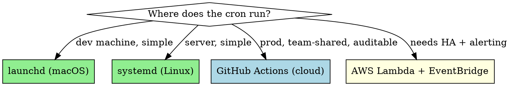

# PSI Weekly Cron Baseline

## Overview

Automates Google PageSpeed Insights v5 tracking for a configurable list of URLs. Runs on a cron schedule (launchd on macOS, systemd timers on Linux, or GitHub Actions for cloud-ready setup). Stores each run as a row in an NDJSON file for easy historical analysis. Optional regression detection compares current run to N-week average and alerts when scores drop > threshold.

**Why:** PSI single-shot tells you the current state. PSI over time tells you whether your optimizations stuck — and catches regressions from theme updates, plugin installs, or third-party-script bloat before customers notice.

## When to use

- After a performance optimization sprint — verify it stays optimized
- Set up on a site you're consulting — get a 12-week baseline before recommendations
- E-commerce shop using lots of plugins — catch each plugin's perf impact
- Any site where Core Web Vitals are critical to revenue

**Don't use for:**
- One-shot audits (use `seo-audit-free` instead)
- Sites with <5 critical URLs (manual checking is fine)
- Internal/staging sites (PSI can't reach them — use Lighthouse CLI locally)

## Architecture choices



Recommendation: start with **launchd** locally to validate. Migrate to **GitHub Actions** for team-shared / production use. AWS Lambda only if you need true 24/7 reliability beyond your local machine's uptime.

## Configuration

Create `psi-config.json`:
```json
{
  "api_key": "YOUR_GOOGLE_API_KEY",
  "strategies": ["mobile", "desktop"],
  "categories": ["performance", "seo", "accessibility", "best-practices"],
  "urls": [
    { "label": "homepage", "url": "https://example.com/" },
    { "label": "main-category", "url": "https://example.com/products/" },
    { "label": "top-product", "url": "https://example.com/products/bestseller/" },
    { "label": "checkout", "url": "https://example.com/checkout/" }
  ],
  "output_dir": "./psi-history",
  "alert_threshold_drop": 10,
  "alert_baseline_weeks": 4
}
```

URL count: keep at 5–20 critical URLs. PSI v5 free quota is 25,000 calls/day — way more than needed for weekly runs.

## Workflow

### Step 1 — Get a free Google API key

1. Visit [console.cloud.google.com](https://console.cloud.google.com/)
2. Create or pick a project
3. Library → enable "PageSpeed Insights API"
4. Credentials → Create credentials → API key
5. (Recommended) Restrict key to "PageSpeed Insights API" only

### Step 2 — Add the cron job

**macOS launchd** (recommended for dev):

`~/Library/LaunchAgents/com.you.psi-weekly.plist`:
```xml
<?xml version="1.0" encoding="UTF-8"?>
<!DOCTYPE plist PUBLIC "-//Apple//DTD PLIST 1.0//EN" "http://www.apple.com/DTDs/PropertyList-1.0.dtd">
<plist version="1.0">
<dict>
    <key>Label</key><string>com.you.psi-weekly</string>
    <key>ProgramArguments</key>
    <array>
      <string>/usr/local/bin/node</string>
      <string>/path/to/psi-fetch.example.js</string>
    </array>
    <key>StartCalendarInterval</key>
    <dict>
      <key>Weekday</key><integer>1</integer>
      <key>Hour</key><integer>4</integer>
      <key>Minute</key><integer>0</integer>
    </dict>
    <key>StandardOutPath</key><string>/tmp/psi-weekly.log</string>
    <key>StandardErrorPath</key><string>/tmp/psi-weekly.err</string>
</dict>
</plist>
```
Load it: `launchctl load ~/Library/LaunchAgents/com.you.psi-weekly.plist`

**GitHub Actions** (recommended for team/prod):

`.github/workflows/psi-weekly.yml`:
```yaml
name: PSI Weekly Baseline
on:
  schedule:
    - cron: '0 4 * * 1'    # Monday 4 AM UTC
  workflow_dispatch:        # manual trigger
jobs:
  psi:
    runs-on: ubuntu-latest
    steps:
      - uses: actions/checkout@v4
      - uses: actions/setup-node@v4
        with: { node-version: 20 }
      - name: Run PSI fetch
        env:
          GOOGLE_API_KEY: ${{ secrets.GOOGLE_API_KEY }}
        run: node ./psi-fetch.example.js
      - name: Commit history
        run: |
          git config user.name 'psi-bot'
          git config user.email 'bot@noreply.example.com'
          git add psi-history/
          git diff --cached --quiet || git commit -m "psi: weekly baseline $(date +%Y-%m-%d)"
          git push
```

### Step 3 — The fetch script

See `psi-fetch.example.js` in this skill folder. It:
1. Reads config
2. Calls PSI v5 for each URL × strategy
3. Extracts key metrics (Performance, SEO, A11y, Best Practices, LCP, CLS, INP, TBT, TTFB, CrUX category)
4. Appends one NDJSON row per call to `<output_dir>/history.ndjson`
5. Computes 4-week rolling average per URL
6. Logs regression alerts if any score dropped > `alert_threshold_drop` vs baseline

### Step 4 — Analyze trends

The NDJSON format makes ad-hoc queries easy:

```bash
# Latest values per URL
jq -s 'group_by(.url) | map(max_by(.timestamp))' psi-history/history.ndjson

# Performance score trend for homepage
jq -r 'select(.url == "https://example.com/" and .strategy == "mobile") | "\(.date) \(.score)"' psi-history/history.ndjson | sort

# All regressions in last 30 days
jq -r 'select(.regression == true and .date > "2026-04-01") | "\(.date) \(.url) \(.metric) dropped from \(.baseline) to \(.score)"' psi-history/history.ndjson
```

For visualization, pipe NDJSON → CSV → Google Sheets / Datadog / Grafana.

## Regression detection logic

```js
function isRegression(currentScore, baselineAvg, threshold) {
  return (baselineAvg - currentScore) >= threshold;
}
```

Example: baseline 4-week avg = 78, current = 65, threshold = 10 → REGRESSION (drop of 13). Alert.

**Avoid noise:**
- Don't alert on single-run anomalies — PSI lab scores have ±5 % variance per run
- Require 2 consecutive bad runs OR drop > 15 % vs baseline
- Whitelist known-causal events (theme update, plugin install) by adding an exclusion period

## Common gotchas

| Pitfall | Mitigation |
|---------|------------|
| PSI quota exhausted | Free tier is 25k/day with key — way more than needed. If exhausted, you forgot to set the API key. |
| Lab scores fluctuate wildly | Use 2-3 consecutive runs and average. CrUX field data is more stable but requires sufficient site traffic. |
| Site is geo-restricted | PSI runs from Google servers — your geo-restricted endpoint won't be reachable. Use Lighthouse CLI locally instead. |
| URL list grows unbounded | Cap at 20 URLs. Add new URLs only if business-critical. |
| Cron runs but no commits to GHA | GHA permission settings — needs write contents permission for the bot |
| Same URL different parameters reports inconsistent scores | PSI treats query string variants as different URLs. Pick canonical form, stick to it. |

## Cost estimate

- **API: free** (25k calls/day quota, you use ~280/month with 20 URLs × 2 strategies × 4 weeks)
- **GitHub Actions runtime: free** for public repos / minimal-minute private repos
- **Storage: ~1KB per data point** = ~280KB/year for 20 URLs

## Real-world anchor data

- DE mattress shop: discovered after 8 weeks of tracking that a freshly-installed plugin had silently dropped homepage mobile PSI from 65 → 32. Without baseline tracking, this would have been blamed on Google Core Update 2 months later.

## Related skills

- `seo-audit-free` — for one-shot audits
- `seo-outreach-report` — pipeline includes PSI but only once-per-audit
- `claude-seo:seo-google` — alternative implementation in claude-seo plugin

## Implementation

Starter script `psi-fetch.example.js` + config template `psi-config.example.json` provided in this folder. Customize URL list, output directory, and alert threshold.
